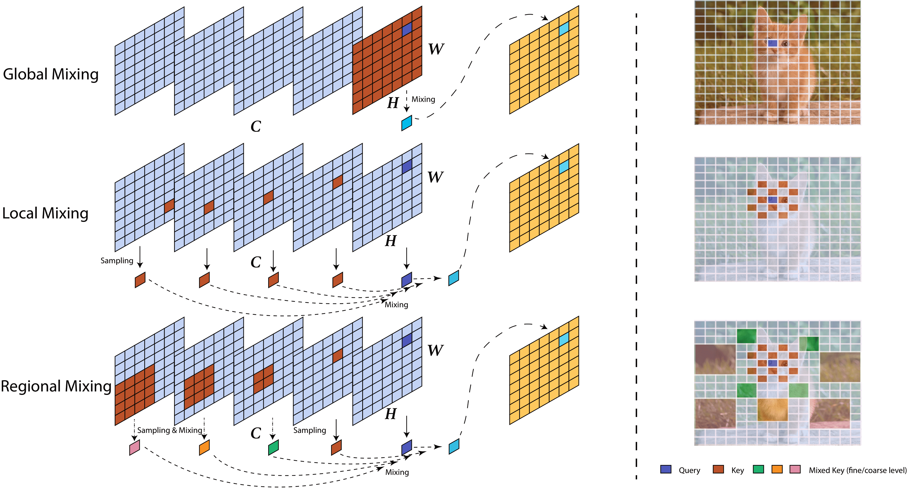
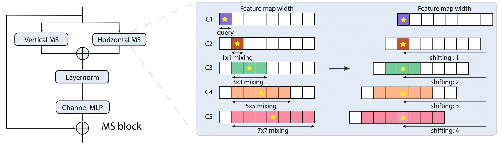

# MS-MLP: Mixing and Shifting in Vision Transformers

This is the official implementation of our [MS-MLP -- "Mixing and Shifting: Exploiting Global and Local Dependencies in Vision MLPs"](https://arxiv.org/abs/2202.06510), by Huangjie Zheng, Pengcheng He, Weizhu Chen and Mingyuan Zhou.




The proposed mixing and shifting operation exploit both long-range and short-range dependencies without self-attention. In a MLP-based archtecture, Mix-Shift-MLP (MS-MLP) makes the size of the local receptive field used for mixing increase with respect to the amount of relative distance achived by the spatial shifting. This directly contributes to the interactions between neighbor and distant tokens. 

## Model Overview



In each MS-block, we first split the feature map into several groups along the channel dimension, with the first group regarded as the source of query tokens. In the other groups, as the centers of the attended regions (marked with yellow stars) become more and more distant, we gradually increase the mixing spatial range from 1 x 1 to 7 x 7. After the mixing operation, we shift the split channel groups to align their mixed center tokens with the query and then continue the channel-wise mixing with a channel MLP.

### Image Classification on ImageNet-1K

| Network | Resolution | Top-1 (%) | Params | FLOPs | Throughput (image/s) | model |
|:---:|:---:|:---:|:---:| :---:| :---:|:---:|
| MS-MLP-Tiny | 224x224 | 82.1 | 28M | 4.9G | 792.0 | [download](https://tsciencescu.blob.core.windows.net/projectshzheng/MSMLP/released_model/msmlp_tiny_patch4/msmlp_tiny_patch4_ckpt_epoch299.pth) |
| MS-MLP-Small | 224x224 | 83.4 | 50M | 9.0G | 483.8 | [download](https://tsciencescu.blob.core.windows.net/projectshzheng/MSMLP/released_model/msmlp_small_patch4/msmlp_small_patch4_ckpt_epoch299.pth) |
| MS-MLP-Base | 224x224 | 83.8 | 88M | 16.1G | 366.5 | [download](https://tsciencescu.blob.core.windows.net/projectshzheng/MSMLP/released_model/msmlp_base_patch4/msmlp_base_patch4_ckpt_epoch299.pth) |


## Getting Started

### Install

- Clone this repo:

```bash
git clone https://github.com/JegZheng/MS-MLP
cd MS-MLP
```

- Create a conda virtual environment and activate it:

```bash
conda create -n msmlp python=3.7 -y
conda activate msmlp
```

- Install `CUDA==10.1` with `cudnn7` following
  the [official installation instructions](https://docs.nvidia.com/cuda/cuda-installation-guide-linux/index.html)
- Install `PyTorch==1.7.1` and `torchvision==0.8.2` with `CUDA==10.1`:

```bash
conda install pytorch==1.7.1 torchvision==0.8.2 cudatoolkit=10.1 -c pytorch
```

- Install `timm==0.3.2`:

```bash
pip install timm==0.3.2
```

- Install `cupy-cuda101` (optional, if you choose to use kernel speed up used in AS-MLP):

```bash
pip install cupy-cuda101
```

- Install `Apex`:

```bash
git clone https://github.com/NVIDIA/apex
cd apex
pip install -v --disable-pip-version-check --no-cache-dir --global-option="--cpp_ext" --global-option="--cuda_ext" ./
```

- Install other requirements:

```bash
pip install opencv-python==4.4.0.46 termcolor==1.1.0 yacs==0.1.8
```

### Data preparation

We use standard ImageNet dataset, you can download it from http://image-net.org/. We provide the following two ways to
load data:

- For standard folder dataset, move validation images to labeled sub-folders. The file structure should look like:
  ```bash
  $ tree data
  imagenet
  ├── train
  │   ├── class1
  │   │   ├── img1.jpeg
  │   │   ├── img2.jpeg
  │   │   └── ...
  │   ├── class2
  │   │   ├── img3.jpeg
  │   │   └── ...
  │   └── ...
  └── val
      ├── class1
      │   ├── img4.jpeg
      │   ├── img5.jpeg
      │   └── ...
      ├── class2
      │   ├── img6.jpeg
      │   └── ...
      └── ...
 
  ```
- To boost the slow speed when reading images from massive small files, we also support zipped ImageNet, which includes
  four files:
    - `train.zip`, `val.zip`: which store the zipped folder for train and validate splits.
    - `train_map.txt`, `val_map.txt`: which store the relative path in the corresponding zip file and ground truth
      label. Make sure the data folder looks like this:

  ```bash
  $ tree data
  data
  └── ImageNet-Zip
      ├── train_map.txt
      ├── train.zip
      ├── val_map.txt
      └── val.zip
  
  $ head -n 5 data/ImageNet-Zip/val_map.txt
  ILSVRC2012_val_00000001.JPEG  65
  ILSVRC2012_val_00000002.JPEG  970
  ILSVRC2012_val_00000003.JPEG  230
  ILSVRC2012_val_00000004.JPEG  809
  ILSVRC2012_val_00000005.JPEG  516
  
  $ head -n 5 data/ImageNet-Zip/train_map.txt
  n01440764/n01440764_10026.JPEG  0
  n01440764/n01440764_10027.JPEG  0
  n01440764/n01440764_10029.JPEG  0
  n01440764/n01440764_10040.JPEG  0
  n01440764/n01440764_10042.JPEG  0
  ```


### Evaluation

To evaluate a pre-trained `MS-MLP` on ImageNet val, run:

```bash
python -m torch.distributed.launch --nproc_per_node <num-of-gpus-to-use> --master_port 12345 main.py --eval \
--cfg <config-file> --resume <checkpoint> --data-path <imagenet-path> 
```

For example, to evaluate the `MS-MLP-Tiny` with a single GPU:

```bash
python -m torch.distributed.launch --nproc_per_node 1 --nnodes=1 --master_port 12345 main.py --eval \
--cfg configs/msmlp_tiny_patch4_shift5_224.yaml --resume <msmlp-tiny.pth> --data-path <imagenet-path>
```


### Training from scratch

To train a `MS-MLP` on ImageNet from scratch, run:

```bash
python -m torch.distributed.launch --nproc_per_node <num-of-gpus-to-use> --master_port 12345  main.py \ 
--cfg <config-file> --data-path <imagenet-path> [--batch-size <batch-size-per-gpu> --output <output-directory> --tag <job-tag>]
```

**Notes**:

- To use zipped ImageNet instead of folder dataset, add `--zip` to the parameters.
    - To cache the dataset in the memory instead of reading from files every time, add `--cache-mode part`, which will
      shard the dataset into non-overlapping pieces for different GPUs and only load the corresponding one for each GPU.
- When GPU memory is not enough, you can try the following suggestions:
    - Use gradient accumulation by adding `--accumulation-steps <steps>`, set appropriate `<steps>` according to your need.
    - Use gradient checkpointing by adding `--use-checkpoint`, which can save a lot of GPU memory.
      Please refer to [this page](https://pytorch.org/docs/stable/checkpoint.html) for more details.
    - We recommend using multi-node with more GPUs for training very large models, a tutorial can be found
      in [this page](https://pytorch.org/tutorials/intermediate/dist_tuto.html).
- To change config options in general, you can use `--opts KEY1 VALUE1 KEY2 VALUE2`, e.g.,
  `--opts TRAIN.EPOCHS 100 TRAIN.WARMUP_EPOCHS 5` will change total epochs to 100 and warm-up epochs to 5.
- For additional options, see [config](config.py) and run `python main.py --help` to get detailed message.

For example, to train `MS-MLP` with 8 GPU on a single node for 300 epochs, run:

`MS-MLP-Tiny`:

```bash
python -m torch.distributed.launch --nproc_per_node=8 --nnodes=1 main.py \
--cfg configs/msmlp_tiny_patch4_shift5_224.yaml --data-path <imagenet-path> --batch-size 128 --cache-mode no \
--accumulation-steps 0 --output <output-path>
```

`MS-MLP-Small`:

```bash
python -m torch.distributed.launch --nproc_per_node=8 --nnodes=1 main.py \
--cfg configs/msmlp_small_patch4_shift5_224.yaml --data-path <imagenet-path> --batch-size 128 --cache-mode no \
--accumulation-steps 0 --output <output-path>
```

`MS-MLP-Base`:

```bash
python -m torch.distributed.launch --nproc_per_node=8 --nnodes=1 main.py \
--cfg configs/msmlp_base_patch4_shift5_224.yaml --data-path <imagenet-path> --batch-size 64 --cache-mode no \
--accumulation-steps 2 --output <output-path>
```

For multi-node training, please add `--node_rank`, `--master_addr`, `--master_port` options. For example:

```bash
python -m torch.distributed.launch --nproc_per_node=8 --nnodes=2 --node_rank=$RANK --master_addr $MASTER_ADDR --master_port $MASTER_PORT  main.py \
--cfg configs/msmlp_base_patch4_shift5_224.yaml --data-path <imagenet-path> --batch-size 64 --cache-mode no \
--accumulation-steps 0 --output <output-path>
```

### Throughput

To measure the throughput, run:

```bash
python -m torch.distributed.launch --nproc_per_node 1 --master_port 12345  main.py \
--cfg <config-file> --data-path <imagenet-path> --batch-size 64 --throughput --amp-opt-level O0
```

## Citation

If you find this repo useful to your project, please consider to cite it with following bib:

    @misc{zheng2022mixing,
      title={Mixing and Shifting: Exploiting Global and Local Dependencies in Vision MLPs}, 
      author={Huangjie Zheng and Pengcheng He and Weizhu Chen and Mingyuan Zhou},
      year={2022},
      eprint={2202.06510},
      archivePrefix={arXiv},
      primaryClass={cs.CV}
    }

## Acknowledgement

Our codebase is built based on [Swin-Transformer](https://github.com/microsoft/Swin-Transformer), [AS-MLP](https://github.com/svip-lab/AS-MLP) and [Focal-Transformer](https://github.com/microsoft/Focal-Transformer). We thank the authors for the nicely organized code!
